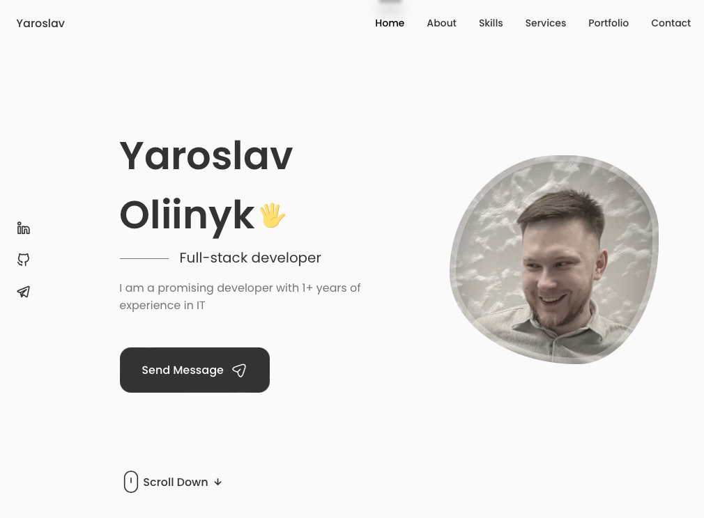

  <h2 align="center">My Personal Portfolio Website</h2>

Fully responsive personal portfolio website,  Responsive for all devices, build using HTML, CSS, and JavaScript.

<a href="https://4106677.github.io/personal-portfolio/"><strong>➥ Live Demo</strong></a>

 

### Demo Screenshots

### HeatGuard proposal

Ukrainian cooperation proposal with ownership terms, two budgets and three mobile UI concepts:
[Open proposal](https://4106677.github.io/personal-portfolio/proposals/).

Source: `public/proposals/`. This standalone route is copied into the production build and works directly on GitHub Pages without SPA rewrites. Browser print supports saving the proposal as PDF. Mockups use demonstration data and do not connect to equipment.
